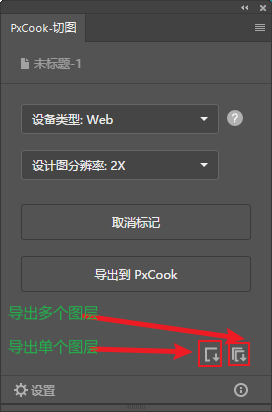

# Node

node最新版本:https://nodejs.org/zh-cn/download/
node 8版本:https://nodejs.org/download/release/v8.9.4/

node 16版本[下载 | Node.js 中文网 (nodejs.cn)](https://nodejs.cn/download/)

参考文献:[Node及nvm安装及环境变量控制（有效） - 掘金 (juejin.cn)](https://juejin.cn/post/7034518395643133983)

参考文献:[(26条消息) Nodejs安装教程_彭佼的博客-CSDN博客](https://blog.csdn.net/qq_48485223/article/details/122709354?ops_request_misc=%7B%22request%5Fid%22%3A%22167840918916782425158853%22%2C%22scm%22%3A%2220140713.130102334..%22%7D&request_id=167840918916782425158853&biz_id=0&utm_medium=distribute.pc_search_result.none-task-blog-2~all~top_positive~default-1-122709354-null-null.142^v73^control,201^v4^add_ask,239^v2^insert_chatgpt&utm_term=安装node&spm=1018.2226.3001.4187)


#### node安装以及环境变量的配置

##### 1.记住node安装地址(下面将安装地址代指为NNN): 

C:\Program Files\nodejs\

1.1.系统变量的path改为NNN,一般默认就是NNN,不用修改
1.2.查看node和npm是否安装成功,cmd输入:
node -v
npm -v
2.查看node全局的安装路径
npm config get prefix

##### 3.在node文件夹下新建两个文件: 
node_global
node_cache
##### 4.将node全局的安装路径改为新建的文件: 
npm config set prefix "NNN\node_global"
npm config set cache "NNN\node_cache"
5.安装一个全局包试一下
npm i express -g

##### 6.应该会报错,原因:没有权限,
暂时解决:以管理员身份打开cmd
永久解决:找到nodejs文件夹,右键>>属性>>安全>>用户权限改为全面控制
##### 7.有权限了,但是下载包还是会报错,node/npm不是一个命令或程序,原因:因为我们修改了全局包的存放路径
解决:环境变量>>系统变量>>路径改为我们设置的全局安装路径:
NNN\node_global
8.成功!!
9.用户变量的npm是这个,以防被修改了,备注下: C:\Users\86177\AppData\Roaming\npm


#### 其他：

参考文献:[适用于 Windows Server 和 Windows 的密钥管理服务 (KMS) 客户端激活和产品密钥 | Microsoft Learn](https://learn.microsoft.com/zh-cn/windows-server/get-started/kms-client-activation-keys#windows-10-all-supported-semi-annual-channel-versions)

###### kms密钥管理服务激活电脑

管理员身份运行cmd，输入三行代码即可(仅适用于本公司)

windows10专业版动态密钥 :W269N-WFGWX-YVC9B-4J6C9-T83GX

windows11专业版动态密钥:W269N-WFGWX-YVC9B-4J6C9-T83GX

win server 2019 标准版动态密钥：N69G4-B89J2-4G8F4-WWYCC-J464C

```
slmgr /ipk 动态密钥
slmgr /skms 10.0.1.10
slmgr /ato
```

###### pxe可以安装系统


# npm sass less使用

##### npm
npm view 包名 versions 查看包可用的所有版本
npm cache clean -f 有时候会因为npm的缓存而导致下载失败,强制清除缓存

##### sass
1.在vue中直接配置项选择sass,然后在style标签中添加lang="scss"
例:<style lang="scss" scoped>

2.没有提前配置(不建议
2.1.终端输入 npm i sass-loader -D
2.2.标签添加
例:<style lang="scss" scoped>

##### less
在vue中使用less,只需两步
1.终端输入 npm install --save-dev less-loader less
2.标签添加
例:<style lang="less" scoped>

sass和less的原生使用
使用vscode搭配easy sass/easy less使用,该插件会将后缀为.less/.scss的文件编译并生成一个css的文件,我们在html中引入这个css即可


# 切图

#### 像素大厨
像素大厨可以直接使用vw单位来进行测量.1vw=1%100的窗口宽度.
像素大厨可以使用png和psd进行开发.

#### PS切图
pxCook参考文档:https://www.fancynode.com.cn/pxcook/slice#ps

1.点击图层,右键选择,快速导出PNG (png图片格式背景为透明
2.点击图层,右键选择,导出为...,可以选择多种存储格式

3.pxCook插件切图,打开像素大厨给ps安装pxCook插件,重启ps打开后,在扩展程序中找到pxCook




3.1.点击图层>>pxcook标记>>导出到本地 (默认为png格式
3.2.可以标记多个,导出所有到本地 (注意:标记不取消,之前导过的会重复导出

##### 其他:

如果设计图大小不是1X的,可以使用ps进行裁剪和设置图片像素大小

遇到需要多个图层合并的效果可以使用快捷键:
shift键选中多个图层,ctrl + E,可以合并图层

调节亮度在显示器下方

电脑不具有蓝牙


# GIT

git下载地址:[Git - Downloads (git-scm.com)](https://git-scm.com/downloads)

git参考文档:[Git - 获取 Git 仓库 (git-scm.com)](https://git-scm.com/book/zh/v2/Git-基础-获取-Git-仓库)

git参考文档:[(12条消息) 关于Git这一篇就够了_17岁boy想当攻城狮的博客-CSDN博客](https://blog.csdn.net/bjbz_cxy/article/details/116703787)

git参考文档:[(12条消息) Git系列（一）、Git基础教程【建议收藏】_git 基础_一宿君的博客-CSDN博客](https://blog.csdn.net/qq_52596258/article/details/119643715?ops_request_misc=%7B%22request%5Fid%22%3A%22167892675616800211581487%22%2C%22scm%22%3A%2220140713.130102334..%22%7D&request_id=167892675616800211581487&biz_id=0&utm_medium=distribute.pc_search_result.none-task-blog-2~all~top_positive~default-2-119643715-null-null.142^v73^control,201^v4^add_ask,239^v2^insert_chatgpt&utm_term=git&spm=1018.2226.3001.4187)


##### 配置githup的ssh地址

git bush中输入:
**ssh-keygen -t rsa -C "3071449254@qq.com"**
回车回车回车
此时在/c/Users/yaolei/.ssh文件夹下生成了两个文件 (个人地址
id_rsa:私钥，不能泄露出去
id_rsa.pub:公钥，可以告诉任何人
**githup>>右侧头像>>设置>>密钥>>New SSH Key**
输入title:随便写
**输入key:在gitbash中的提示地址中找到.ssh文件夹>>id_rsa.pub,复制文件内容粘贴**
Add SSH key
检测SSH key是否配置成功,cmd输入ssh -T git@git网站,例:
ssh -T git@github.com
看到这句话说明安装成功了,有时网络问题,需要等一下
Hi ya0lei! You've successfully authenticated, but GitHub does not provide shell access.
可能在提交代码的时候让你输入用户名和邮箱,vscode终端输入:
git config --global user.name "你的用户名"
git config --global user.email "你的邮箱"


#### git有仓库在本地拉取代码

**1**.githup创建仓库

**2**.cmd输入git clone "远程地址" (注意:ssh密钥每台电脑不一样,换了电脑需要重新配置,但是https是可以访问的,只是需要输入git账号密码

**3**.在本地提交代码
git add . (提交所有文件到暂存区
git commit -m "第一次提交代码" (把暂存区的代码提交到远程

**4**.在远程提交代码

git pull (拉取远程的代码并且合并到本地
git push (代码发到远程


#### git有仓库在本地建立链接

**1**.githup创建仓库
**2**.在本地文件初始化git
在本地文件中cmd,输入:

git init (初始化当前仓库,会创建一个git文件
ls -ah (查看隐藏目录,看是否有git,也可以直接点开文件夹看是否生成了一个git文件

**3**.在本地提交代码

git add . (提交所有文件到暂存区

git commit -m "第一次提交代码"

**4**.在远程提交代码

git remote add origin ssh地址 (关联远程仓库

git pull (拉取远程的代码而且合并到本地,提交之前需要建立分支
git push (代码发到远程


#### git建立分支

vscode左下角点点点

git checkout -b yaolei (创建分支并切换
git checkout yaolei (切换到指定的分支

**git push -u origin master** (master分支推送到远程,-u表示记住远程分支,下次推送直接git push

git merge yaolei (合并当前的分支到主分支
git branch -a (查看所有的分支
git branch -D yaolei (删除本地分支,如果要删除master,记得把默认主分支切换成其他的分支,默认主分支是无法删除的
git push origin --delete yaolei (删除远程分支

git checkout -- file (将文件撤销回到最近一次修改的状态

##### git其他:

**工作区**:vscode的文件目录

**暂存区**:git文件夹下的index,本地的

**版本库**:git文件夹,git的本地版本仓库

文件状态:  

**未跟踪**  **U**字母开头

**已修改**  **M**字母开头

**已暂存**  **A**字母开头 

**注意**:本地分支存在于本地的git文件中,远程分支在git官网上,所以删除分支先删本地,再删远程为好!

| 语法:                     | 作用:                                                       |
| ------------------------- | ----------------------------------------------------------- |
| git add 文件地址          | 添加单个文件,根目录下可以直接写文件名,更目录文件夹/文件名ls |
| git config --list         | 查看git当前的配置,用户名和邮箱也可以看到                    |
| git log                   | 查看历史提交日志,看看刚才提交是否成功了                     |
| git status                | 查看git的状态,可以看哪些文件被修改了                        |
| git reset HEAD .          | 移除所有暂存文件                                            |
| git restore --staged file | 撤回暂存区的修改,暂存区撤回后记得工作区也撤回一下           |
| git rm 文件名             | 工作区和版本库同时删除此文件                                |
| git remote -v             | 查看远程仓库地址                                            |


# Angular

Angular参考文献:[Angular - 理解 Angular](https://angular.cn/guide/understanding-angular-overview)

Angular参考文档:[(14条消息) angular框架简介基础与使用（全文2w8字）前端框架angular_百事可口的博客-CSDN博客](https://blog.csdn.net/qq_38594056/article/details/124546547?ops_request_misc=%7B%22request%5Fid%22%3A%22167930149816800225548471%22%2C%22scm%22%3A%2220140713.130102334..%22%7D&request_id=167930149816800225548471&biz_id=0&utm_medium=distribute.pc_search_result.none-task-blog-2~all~top_click~default-2-124546547-null-null.142^v74^wechat,201^v4^add_ask,239^v2^insert_chatgpt&utm_term=angular&spm=1018.2226.3001.4187)

Angular参考文档:[(14条消息) 也许是全网最全的 Angular 新手入门指南_angular入门教程_萌萌哒の瑞萌萌的博客-CSDN博客](https://blog.csdn.net/weixin_46232841/article/details/124918326?ops_request_misc=%7B%22request%5Fid%22%3A%22167930149816800225548471%22%2C%22scm%22%3A%2220140713.130102334..%22%7D&request_id=167930149816800225548471&biz_id=0&utm_medium=distribute.pc_search_result.none-task-blog-2~all~top_positive~default-1-124918326-null-null.142^v74^wechat,201^v4^add_ask,239^v2^insert_chatgpt&utm_term=angular&spm=1018.2226.3001.4187)

Angular组件库:[穿梭框(Transfer) | NG-ZORRO (ant.design)](https://ng.ant.design/components/transfer/zh)

**介绍**:
谷歌开发,  单页面应用,mvvm?更像mvc,基于ts,封装了webpack

**文件关系**:
main.ts入口,启动模块app.module.ts
src/app/app.module.ts引入各种功能.导出
模板在.html
样式在.css
测试在.spec.ts
数据方法在.component.ts
文件关联在.component.ts

#### 环境:
npm config set registry https://registry.npm.taobao.org (切换淘宝镜像源
npm install -g typescript (全局安装ts
npm install @angular/cli -g(全局安装Angular cli
ng v (查看是否安装成功

新建Angular项目:
前提条件:node版本≥10.9
1.搭建运行项目
ng new 项目名
cd ./项目名
ng serve -o (-o可以自动打开地址,不加-o也可以
ctrl c (结束运行

**在此系统上禁止运行脚本yarn或vue,解决**:
win + s搜索PowerShell,以管理员运行,输入:
set-ExecutionPolicy RemoteSigned
输入:y

#### cli新建文件

默认在src/app文件夹下创建

| 语法:                              | 作用:                        |
| ---------------------------------- | ---------------------------- |
| ng g c components/my-new-component | 在src/app/components新建组件 |
| ng g c my-new-component            | 新建组件                     |
| ng g cl my-new-class               | 新建class                    |
| ng g d my-new-directive            | 新建指令                     |
| ng g e my-new-enum                 | 新建枚举                     |
| ng g m my-new-module               | 新建模块                     |
| ng g p my-new-pipe                 | 新建管道                     |
| ng g s my-new-service              | 新建服务                     |

#### Angular生命周期

| 生命周期:               | 触发时机:                                                    |
| ----------------------- | ------------------------------------------------------------ |
| ngOnChanges()           | 给html模板绑定数据和方法触发,后续数据变化也触发,如果html没绑定任何东西不触发 |
| ngOnInit()              | 初始化,显示模板绑定的数据,方法,只执行一次                    |
| ngDoCheck()             | 自定义监听变化,在ngOnChanges无法监听到某个值的变化时使用     |
| ngAfterContentInit()    | 内容投影插入后,只执行一次                                    |
| ngAfterContentChecked() | 内容投影更新时                                               |
| ngAfterViewInit()       | 初始化视图后,只执行一次                                      |
| ngAfterViewChecked()    | 视图变化时                                                   |
| ngOnDestroy()           | 指令,组件销毁后                                              |


**Angular可以自动测试**
ng test

安装vsCode的Angular插件
名称: Angular Language Service
名称: Angular 10 Snippets - TypeScript, Html, Angular 

插件快捷语法:
ng-component (生成component.ts的代码块,用命令可以快速创建代码,用不上

#### 语法:

具体语法详见家里蹲

| 语法:                                                        | 作用:                                            |
| ------------------------------------------------------------ | ------------------------------------------------ |
| {{ msg }}                                                    | 插值表达式,同vue                                 |
| [ id ]="动态值"                                              | 自定义属性,同vue的 :属性=动态值                  |
| ( click )="自定义事件()"                                     | 绑定自定义事件,同vue的 @click="自定义事件"       |
| [ innerHTML ]="内容"                                         | 绑定html内容                                     |
| <li *ngFor="let item of list;let key=index">{{ item }}</li>  | 循环                                             |
| <div *ngTf="flag"></div>                                     | if                                               |
| <div [ngClass]="{'类名1':true,'类名2':false,'类名3':flag==true}"></div> | 决定类名是否生效,可以写表达式                    |
| [ngstyle]                                                    | 样式                                             |
| {{ XXX \| XXX }}                                             | 管道                                             |
| <input [(ngModel)]="数据"></input>                           | 同vue的v-model                                   |
| :host                                                        | Anguar的伪类选择器,让样式只作用于自己,不给子元素 |
| :host(.a)                                                    | 选择自身子元素的所有.a                           |
| :host-context(.a)                                            | 选择自身祖先元素中的所有.a                       |
| <div #name></div>                                            | 同vue的ref                                       |


# Angular组件库

ng-zorro-antd的使用:

1.**引入组件库**:
ng add ng-zorro-antd
2.**配置**:
Angular会自动配置,无需手动引入


3.**使用组件**:

1.需要什么组件就在app.model.ts文件中引入＋注册
2.在官网复制css,html,js

注意:在app.model.ts中引入后所有的组件都可以使用了,无需重复引入
注意:Angular和NG库的版本需保持一致
npm uninstall ng-zorro-antd （卸载）
npm install ng-zorro-antd@7.5.1 --save （安装）


# 小技巧

## debug

debug参考文档:[源工具概述 - Microsoft Edge Development | Microsoft Learn](https://learn.microsoft.com/zh-cn/microsoft-edge/devtools-guide-chromium/sources/)

书写代码时添加断点,使用关键词: debugger;

新增jQuery笔记,新增CSS3动画笔记,新增Angular笔记

## 文字超宽变省略号:

**1.单行css**
width: 400px;
overflow: hidden;
white-space: nowrap;
text-overflow: ellipsis;

**2.多行文本超宽变省略号**
display: -webkit-box;
          -webkit-line-clamp: 2;
          -webkit-box-orient: vertical;
          overflow: hidden;

**3.字符长度,正则替换**
// 获取字符的长度,超过指定长度,把超出的部分替换为...
let str = item.contents;
if (str.length > 200) {
// 正则替换
 str = str.replace(str.slice(160), "...");
}

## 时间格式化

目标格式:2022-04-20 19:01:09
1.引入moment.js
2.moment('2022-04-20T19:01:09+08:00').format('YYYY-MM-DD HH:mm:ss');

## rem适配的另一种方式

更加方便的计算一个元素具有多少rem
**设置html的font-size为13.33334vw**后,在750设计稿下,直接原图测量尺寸,(xxx = 测量的尺寸 / 100),在代码中写xxxrem即可,其他尺寸要麻烦一些,如下:
**最终值(rem单位) = 750设计稿下测量的px单位 / 100**
最终值(rem单位) = 375设计稿下测量的px单位 / 50
最终值(rem单位) = 其他设计稿下测量的px单位 / (其他设计稿尺寸/375*50)


开关,兄弟选择器
轮播图
全屏滚动
锚点链接
tabbar
loading


antdesin
vant
element    
layui
小程序

echats

winCss

环境变量

gis