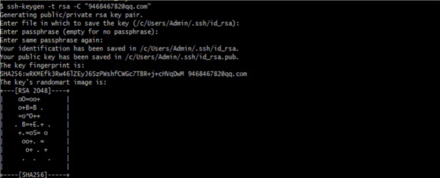
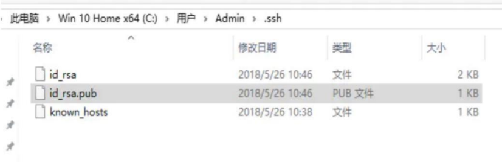
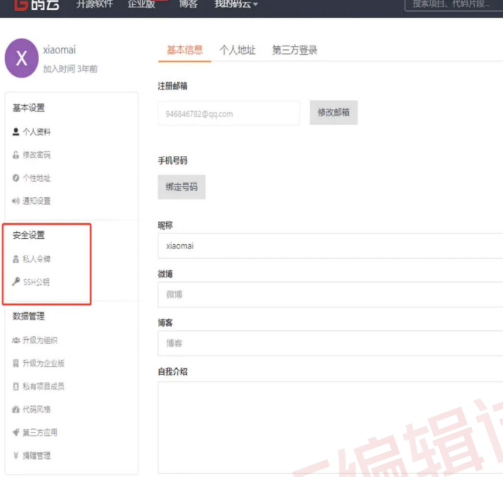
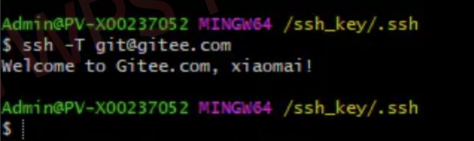

## **git** 阶段面试题及答案

#### **1、git 的基本使用方法（必会）**  

**第一步**：window 本机电脑安装 git 软件（只需要一次） 

**第二步**：配置环境变量（只需要一次） 

安装到 D:\software\git\目录，把 bin 目录路径完整加入 Path 变量。

D:\software\git\bin 

**第三步**：配置 git 的 config（只需要一次） 

git config --global user.email "you@example.com" 

git config --global user.name "Your Name" 

查看你的配置是 git config --list 

**第四步**：使用 git 开始工作 （每次） 

1 、在本地建立一个文件夹，作为本地代码仓库，并初始化 cmd 中 cd 到该文件夹，执行 

git init 命令，让该文件夹成为受 git 管理的仓库目录。 

2、把某个文件添加到本地仓库（前提项目文件夹有这个文件） 

  

执行 git add HelloWorld.html 命令 

如果暂存所有（git add .） 

3、提交文件到仓库 

git commit -m "第一次使用 git 提交文件"m 后面的“” 可以写上备 s 注信息的） 

#### **2、git 工作流程（必会）**  

##### **git 的作用** 

1、在工作目录中修改某些文件 

2、对修改后的文件进行快照，然后保存到暂存区域 

3、提交更新，将保存在暂存区域的文件快照永久转储到 git 目录中 

##### **git 的工作中使用场景**： 

两个分支 master 和 dev 

##### **项目开始执行流程**  

git branch -a (查看所有分支) 

0、克隆代码 git clone 地址 

1、拉取线上 master 最新代码: git pull origin master 

2、切换到开发分支: git checkout dev 

3、合并 master 本地分支（master）: git merge master 

4、开始开发 

5、开发结束 

6、查看当前文件更改状态: git status 

7、把所有更改代码放到缓存区: git add -A 

8、查看当前文件更改状态 : git status 

9、缓存区内容添加到仓库中: git commit -m '本次更改注释' 

10、把代码传到 gitLab 上: git push origin dev 

11、若代码到达上线标准则合并代码到 master,切换分支到 master: git checkout master 

12、拉取 master 最新分支: git pull origin master 

13、合并分支代码到 master(若有冲突则解决冲突): git merge dev 

14、把当前代码上传到 gitLab: git push origin master 

15、代码上线后，用 tag 标签标记发布结点(命名规则：prod_+版本_+上线日期) 

git tag -a prod_V2.1.8_20200701

16、tag 标签推到 gitLab 

git push origin prod_V2.1.8_20200701

##### **缓存区的应用** 

1、需要合并别人代码进来 

1.1）把自己的代码放入暂存: git stash  

1.2）如果需要释放出来用: git stash pop#恢复最近一次的暂存 

1.3）查看你有哪些队列: git stash list 

1.4）删除第一个队列，以此可以类推: git stash drop stash@{0} 

2、需要切换分支 

2.1）git add -A 

2.2）git stash save 'demo' 

2.3）git stash list 

2.4）git stash apply stash@{0} 

##### **补充指令**  

git reflog 查看提交记录命令： 

git show # 显示某次提交的内容 git show $id 

git rm <file> # 从版本库中删除文件 

git reset <file> # 从暂存区恢复到工作文件 

git reset HEAD^ # 恢复最近一次提交过的状态，即放弃上次提交后的所有本次修改 

git diff <file> # 比较当前文件和暂存区文件差异 git diff 

git log -p <file> # 查看每次详细修改内容的 diff 

git branch -r # 查看远程分支 

git merge <branch> # 将 branch 分支合并到当前分支 

git stash pop git pull # 抓取远程仓库所有分支更新并合并到本地 

git push origin master # 将本地主分支推到远程主分支 

git branch 分支名#创建分支 

git checkout 分支名#切换分支 

git checkout -b 分支名#创建并切换分支 

git branch --merge / git branch --no-merge#查看已经合并的分支/未合并的分支 

git branch -d 分支名 / git branch -D 分支名#删除的已合并的分支/未合并的分支 

#### **3、我们如何使用 git 和开源的码云或 github 上面的远端仓库的项**目进行工作呢（必会）

##### **客户端本地 git 如何和远程仓库码云，github 连接上次文件**  

git 仓库如 github 都是通过使用 SSH 与客户端连接的！ 

我们通过本地 git 生成生成密钥对后，将公钥保存至 github，每次连接时 SSH 客户端发送 

地私钥（默认~/.ssh/id_rsa）到服务端验证。单用户情况下，连接的服务器上保存的公钥 

发送的私钥自然是配对的 

命令如下：ssh-keygen -t rsa -C 'XXX@qq.com' -f id_rsa_second 

本

和 

或 ssh-keygen -t rsa -C "XXX@qq.com" 

邮箱可以换成你的

添加公钥（id_rsa_second.pub）到你的远程仓库（github） 

登陆你的 github 帐户。点击你的头像，然后 Settings -> 左栏点击 SSH and GPG keys  

-> 点 击 New SSH key 

然后你复制上面的公钥内容，粘贴进“Key”文本域内。 title 域，自己随便起个名字。 

点击 Add key。 

完成以后，验证下这个 key 是不是正常工作： 

$ ssh -T git@github.com 

Attempts to ssh to github 

如果，看到： 

Hi xxx! You've successfully authenticated, but github does not # provide shell  

access. 

表示设置已经成功 

码云： 

进入码云的设置页面 

在终端（Terminal）中输入 ssh -T git@gitee.com 若返回 Welcome to gitee.com, yourname! 

代表成功！ 

通常步骤： 

本地新建仓库，输入 git init 初始化，让 git 接管 

关联一个远程仓库：git remote add origin git@github.com:XXXXXXXXX.git 

把文件添加到本地版本库 

git add 文件名 

把文件修改提交到本地仓库 

git commit -m"注释" 

git pull origin master 先将 github 上的代码 pull 下来 

然后在 git push origin master 将最新的修改推送到远程仓库 

git - 查看远程仓库信息 

可以通过命令 git remote show [remote-name] 查看某个远程仓库的详细信息

#### **4、git，github， gitlab 三者之间的联系以及区别（必会）** 

##### 1、git 

git 是一个版本控制系统。 

版本控制是一种用于记录一个或多个文件内容变化，方便我们查阅特定版本修订情况的系 

统。 

早期出现的版本控制系统有：svn、cvs 等，它们是集中式版本控制系统，都有一个单一的 

集中管理的服务器，保存所有文件的修订版本，而协同合作的开发人员都通过客户端连接到这台 

服务器，取出最新的文件或者提交更新。 

而我们的主角 git 是分布式版本控制系统。git 已经成为越来越多开发者的青睐，因为分 

布式的优势是很显著的。 

##### 2、集中式和分布式版本控制系统的区别： 

2.1）分布式版本控制系统下的本地仓库包含代码库还有历史库，在本地就可以查看版本历 

史 

2.2）而集中式版本控制系统下的历史仓库是存在于中央仓库，每次对比与提交代码都必须 

连接到中央仓库 

2.3）多人开发时，如果充当中央仓库的 git 仓库挂掉了，任何一个开发者都可以随时创建 

一个新的中央仓库然后同步就可以恢复中央仓库 

2、 github 和 gitlab  

github 和 gitlab 都是基于 web 的 git 仓库，使用起来二者差不多，它们都提供了分 

享开源项目的平台，为开发团队提供了存储、分享、发布和合作开发项目的中心化云存储的场 

所。 

github 作为开源代码库，拥有超过 900 万的开发者用户，目前仍然是最火的开源项目托 

管

  

平台，github 同时提供公共仓库和私有仓库，但如果使用私有仓库，是需要付费的。 

gitlab 解决了这个问题，你可以在上面创建私人的免费仓库。 

gitlab 让开发团队对他们的代码仓库拥有更多的控制，相比较 github , 

##### **gitlab 特色** 

3.1）允许免费设置仓库权限； 

3.2) 允许用户选择分享一个 project 的部分代码； 

3.3) 允许用户设置 project 的获取权限，进一步提升安全性； 

3.4) 可以设置获取到团队整体的改进进度； 

3.5) 通过 innersourcing 让不在权限范围内的人访问不到该资源； 

所以，从代码的私有性上来看，gitlab 是一个更好的选择。但是对于开源项目而言，github  

依然是代码托管的首选。 

#### **5、github 和码云的区别（必会）**  

##### **github** 

全英文、用户基数多，知名库多、国内访问的话，偶尔会有不稳定，出现上不去的情况、 

私有项目需要付费 

##### **码云** 

全中文、用户量没有 github 多，知名库相对较少、服务器再国内，相对稳定、每个用户有 

1000 个免费的私有项目、访问速度很快，支持 svn，git 两种方式、每个仓库有 1G 的容量 

限制

#### **6、提交时发生冲突，你能解释冲突是如何产生的吗？你是如何解决** **的（必会）**  

##### **冲突是如何产生** 

开发过程中，我们都有自己的特性分支，所以冲突发生的并不多，但也碰到过。诸如公共 

类的公共方法，我和别人同时修改同一个文件，他提交后我再提交就会报冲突的错误。 

##### **如何解决冲突** 

1、发生冲突，在 IDE 里面一般都是对比本地文件和远程分支的文件，然后把远程分支上文 

件的内容手工修改到本地文件，然后再提交冲突的文件使其保证与远程分支的文件一致， 

这样才会消除冲突，然后再提交自己修改的部分。特别要注意下，修改本地冲突文件使其 

与远程仓库的文件保持一致后，需要提交后才能消除冲突，否则无法继续提交。必要时可 

与同事交流，消除冲突。 

2、发生冲突，也可以使用命令 

通过 git stash 命令，把工作区的修改提交到栈区，目的是保存工作区的修改； 

通过 git pull 命令，拉取远程分支上的代码并合并到本地分支，目的是消除冲突； 

通过 git stash pop 命令，把保存在栈区的修改部分合并到最新的工作空间中； 

分支提交冲突：当分支对某文件某句话进行修改后，切换到主分支也对该文件该句话进行 

修改，使用 git merge 进行合并，需要将两个修改进行合并。此时合并产生冲突 

3、另外一种解决方法 

  

3.1）git status 查看冲突文件 

3.2）编辑器打开冲突文件，查看内容。Git 用<<<<<<<，=======，>>>>>>> 

记出不同分支的内容 

  

标 

  

  

3.3）修改文件内容 

3.4）提交 git add file ; git commit -m "" 

查看分支合并图 git log –graph 

#### **7、如果本次提交误操作，如何撤销（必会）**  

如果想撤销提交到索引区的文件，可以通过 git reset HEAD file 

如果想撤销提交到本地仓库的文件 

可以通过 git reset –soft HEAD^n 恢复当前分支的版本库至上一次提交的状态，索引区 

和工作空间不变更；可以通过 git reset –mixed HEAD^n 恢复当前分支的版本库和索引区至上 

一 次提交的状态，工作区不变更；可以通过 git reset –hard HEAD^n 恢复当前分支的版本 

库、索引区和工作空间至上一次提交的状态。 

#### **8、git 修改提交的历史信息（必会）**  

**git 修改提交的历史信息详细操作**  

git rebase -i HEAD~3 

输出如下 

pick 1 commit 1 

pick 2 commit 2 

pick 3 commit 3 

要修改哪个，就把那行的 pick 改为 edit，然后退出。例如想修改 commit 1 的 author，光 

标移到第一个 pick，按 i 键进入 INSERT 模式，把 pick 改为 edit： 

edit 1 commit 1 

pick 2 commit 2

pick 3 commit 3 

…

– INSERT – 

然后按 esc 键，退出 INSERT 模式，输入:wq 退出，这时可以看到提示，可以修改 commit 1 

的信息了 

输入 amd 命令重置用户信息： $ git commit --amend --reset-author 

会出现 commit 1 的提交记录及注释内容，可进入 INSERT 模式修改注释，:wq 退出 

这时再查看提交历史，发现 commit 1 的 author 已经变成 b（b@email.com）了， 且是最新 

一次的记录 

通过 continue 命令回到正常状态： $ git rebase --continue

#### **9、如何删除 github 和 gitlab 上的文件夹（必会）**  

解决办法 

重点在于 git push -u 

方法一: 

这里以删除 .setting 文件夹为案例 

git rm -r --cached .setting #--cached 不会把本地的.setting 删除 

git commit -m 'delete .setting dir' 

git push -u origin master 

方法二: 

如果误提交的文件夹比较多，方法一也较繁琐 

直接修改.gitignore 文件,将不需要的文件过滤掉，然后执行命令 

git rm -r --cached . 

git add . 

git commit 

git push -u origin master 

#### **10、如何查看分支提交的历史记录？查看某个文件的历史记录呢（必** 

**会）**  

**查看分支的提交历史记录**  

命令 git log –number：表示查看当前分支前 number 个详细的提交历史记录 

命令 git log –number –pretty=oneline：在上个命令的基础上进行简化，只显示 sha-1 

码和提交信息； 

命令 git reflog –number: 表示查看所有分支前 number 个简化的提交历史记录 

命令 git reflog –number –pretty=oneline：显示简化的信息历史信息 

**如果要查看某文件的提交历史记录**，直接在上面命令后面加上文件名即可 

注意：如果没有 number 则显示全部提交次数 

#### **11、git 跟 svn 有什么区别（必会）**  

git 是分布式版本控制系统，其他类似于 svn 是集中式版本控制系统。

**分布式区别于集中式在于**：每个节点的地位都是平等，拥有自己的版本库，在没有网络的 

情况下，对工作空间内代码的修改可以提交到本地仓库，此时的本地仓库相当于集中式的远 

程仓库，可以基于本地仓库进行提交、撤销等常规操作，从而方便日常开发 

**git 和 svn 的区别**  

git 是分布式版本控制，svn 是集中式版本控制（核心区别） 

git 相对于 svn 的优势就是不需要网络即可版本控制 

git 把内容按数据方式存储，而 svn 是按文件 

git 可以是公用的，可以分享，svn 基本是公司内部才能访问，网外不方便访问 

git 不依赖中央服务器，即使服务器有问题也不受影响，svn 依赖服务器，一旦服务器有问 

题 就会受影响 

git 没有一个全局的版本号，svn 有 

#### **12、我们在本地工程常会修改一些配置文件，这些文件不需要被提交，** **而我们又不想每次执行 git status都让这些文件显示出来，我们** 该如何操作（必会） 

首先利用命令 touch .gitignore 新建文件 

$ touch .gitignore 

然后往文件中添加需要忽略哪些文件夹下的什么类型的文件 

$ vim .gitignore 

$ cat .gitignore 

/target/class 

.settings 

.imp 

*.ini 

注意：忽略/target/class 文件夹下所有后缀名为.settings，.imp 的文件，忽略所有后缀 

名为.ini 的文件。 

#### **13、git fetch 和 git merge 和 git pull 的区别（必会）**  

**区别如下**  

git pull 相当于 git fetch 和 git merge，即更新远程仓库的代码到本地仓库，然后将 

内容合 并到当前分支。 

git merge: 将内容合并到当前分支 

git pull 相当于是从远程获取最新版本并 merge 到本地 

命令从中央存储库中提取特定分支的新更改或提交，并更新本地存储库中的目标分支。 

git fetch 相当于是从远程获取最新版本到本地，不会自动 merge 

方便记忆: 

git pull = git fetch + git merge 

#### **14、如何把本地仓库的内容推向一个空的远程仓库（高薪常问）**  

首先确保本地仓库与远程之间是连同的。如果提交失败，则需要进行下面的命令进行连通： 

git remote add origin XXXX 

注意：XXXX 是你的远程仓库地址。

如果是第一次推送，则进行下面命令： 

git push -u origin master 

注意：-u 是指定 origin 为默认主分支 

之后的提交，只需要下面的命令： 

git push 

