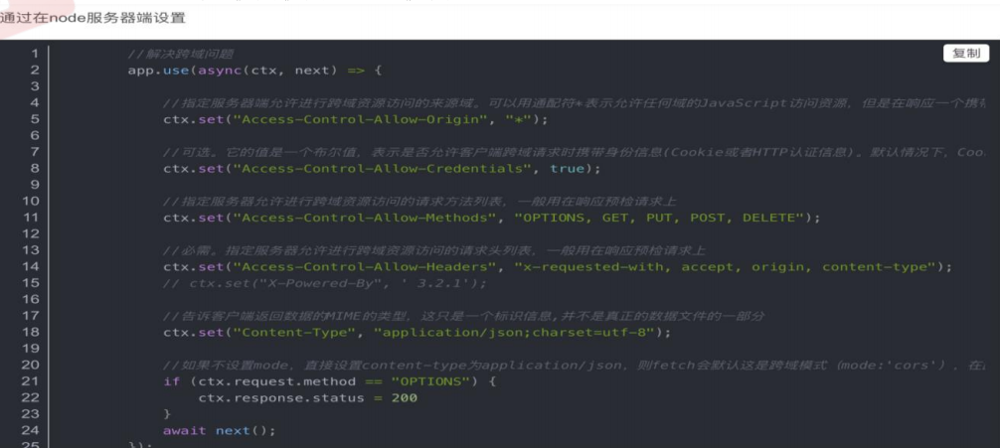
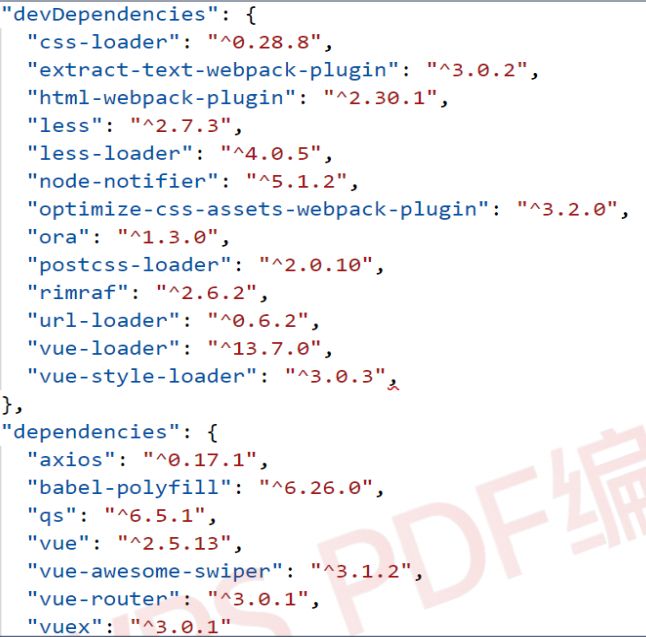

## **Nodejs阶段面试题及答案** 

#### **1、对 Node.js 有没有了解，它有什么特点，适合做什么业务（必会）**  

##### **什么是 Node**  

Node.js...它既是开发平台, 也是运行环境, 也是个新的语言...它本身是基于 google 的 

javascript v8 引擎开发的, 因此在编写基于它的代码的时候使用 javascript 语言. 但是 

又不同于传统概念的 javascript...它的服务端功能以及部分客户端功能必须在服务端运行,  

所以它实际上是一种在服务端的开发+运行的 javascript 语言. 它本身可以作为 HTTP Server,  

也可以当作 TCP Server 用 

##### **特点**  

他是一个 javascript 运行环境，依赖于 Chrome V8 引擎进行代码解释 

特征：单线程、事件驱动、非阻塞 I/O，轻量，可伸缩，适于实时数据交互应用 

单进程，单线程 (一个应用程序对应一个进程, 一个进程下面会有多个线程, 每个线程用 于

处理任务..) 

Node 无法直接渲染静态页面，提供静态服务 

Node 没有根目录的概念 

Node 必须通过路由程序指定文件才能渲染文件 

Node 比其他服务端性能更好，速度更快 

##### **适用业务** 

Node.js 是单线程，非阻塞 I/O，事件驱动，它的特点决定了它适合做一些大量 I/O 的东西， 

比如，聊天室，表单提交等不需要大量计算的功能。做一些微信后端开发，或者做消息系统 

等。可以整个项目用，也可以根据它的特点在某个模块使用，比如 socketio，打造一个消息 

系统等 

#### **2、Node 和前端项目怎么解决跨域的（必会）**  

**设置 CORS 或者 使用使用 CORS 模块**

#### **3、Node 的优点是什么？缺点是什么（必会）** 

#####   **优点** 

1、高并发（最主要的一个优点） 

2、适合 I/O 密集型应用 

##### **缺点** 

1、不适合 CPU 密集型应用；CPU 密集型应用给 node 带来的挑战主要是：由于 JavaScript 单 

线程的原因，如果有长时间运行的计算（比如大循环），将会导致 CPU 时间片不能释放，使 

得后续 I/O 无法发起； 

解决方案：分解大型运算任务为多个小任务，使得运算能够适时释放，不阻塞 I/O 调用的发 

起； 

2、只支持单核 CPU，不能充分利用 CPU 

3、可靠性低，一旦代码某个环节崩溃，整个系统都崩溃 

  **原因：**单进程，单线程 

**解决方案** 

3.1）Nnigx 反向代理，负载均衡，开多个进程，绑定多个端口 

3.2）开多个进程监听同一个端口，使用 cluster 模块 

4、开源组件库质量参差不齐，更新快，向下不兼容 

5、Debug 不方便，错误没有 stack trace 

#### **4、commonJS 中的 require/exports 和 ES6 中 import/export** **的** **区别是什么（必会）**  

##### **commonJS 中的 require/exports**  

commonJS 模块的重要特性是加载时执行，及脚本代码在 require 的时候，就会全部执行。 

一旦出现某个模块被“循环加载”就只输出已经执行的部分，还没有执行的部分是不输出的 

##### **ES6 中 import/export**  

ES6 模块是动态引用，如果使用 import 从一个模块加载变量，那些变量不会缓存，而是成 

为 一个指向被加载模块的引用,import/export 最终都是编译为 require/exports 来执行的 

#### **5、简述同步和异步的区别，如何避免回调地狱，Node 的异步问题是** **如何解决的（必会）**  

##### **同步** 

方法调用一旦开始，调用者必须等到方法调用返回后，才能继续后续的行为 

##### **异步** 

方法调用一旦开始，方法调用就会立即返回，调用者就可以继续后续的操作。而异步方法 

通常会在另外一个线程中，整个过程，不会阻碍调用者的工作 

##### **避免回调地狱** 

1、Promise 

2、async/await 

3、generator 

4、事件发布/监听模式 

Node **的异步问题是如何解决** 

模块化: 将回调函数转换为独立的函数

使用流程控制库，例如 aync 

使用 Promise 

使用 aync/await(参考 async/await 替代 Promise 的 6 个理由)

#### **6、**dependencies 和 devDependencies 两者区别（必会）  

**区别** 

在 npm 生成的 package.json 文件中，有 devDependencies 和 dependencies 两个环境

devDependencies 用于开发环境（本地） 

dependencies 用于生产环境（发布） 

-save //会把依赖包名称添加到 package.json 文件 dependencies 下 

-save-dev //则添加到 package.json 文件 devDependencies 下 

devDependencies 下列出的模块，是我们开发时用的依赖项，像一些进行单元测试之类的包 

//webpack，gulp 等打包工具，这些都是我们开发阶段使用的，代码提交线上时，不需要这 

些工具，所以我们将它放入 devDependencies 即可 

dependencies 下的模块，则是我们生产环境中需要的依赖，即正常运行该包时所需要的依 

项 

//像 jQuery 库文件以及 vue 插件 vue-awesome-swiper，vue-router 路由等是在打包之后 

续用到的，所以放到 dependencies 里面 

"dependencies"：应用程序在生产中需要这些包,即项目上线后所依赖的环境。 

"devDependencies"：这些包仅用于开发和测试,即开发中所需要的产品中就不需要。 

赖

继

#### **7、什么是前后端分离的项目?什么是 JS 渲染的项目，前端渲染和后** **端渲染的区别（高薪常问）**  

##### **前后端分离的项目** 

前端 HTML 页面通过 Ajax 调用后端的 RESTFUL API 接口并使用 JSON 数据进行交互 

##### **JS 渲染的项目**

通过 Ajax 请求数据以后, 通过 JS 代码动态创建 html 的标签和数据等(一般右键查看网页 源

代码 是看不到渲染后的 HTML 标签的) 

##### **前端渲染** 

指的是后端返回 JSON 数据，前端利用预先写的 html 模板，循环读取 JSON 数据，拼接字符 

串（ES6 的模板字符串特性大大减少了拼接字符串的的成本），并插入页面。 

**好处：**网络传输数据量小。不占用服务端运算资源（解析模板），模板在前端（很有可能 

仅部分在前端），改结构变交互都前端自己来了，改完自己调就行。 

**坏处：**前端耗时较多，对前端工作人员水平要求相对较高。前端代码较多，因为部分以前 

在后台处理的交互逻辑交给了前端处理。占用少部分客户端运算资源用于解析模板。 

##### **后端渲染：** 

前端请求，后端用后台模板引擎直接生成 html，前端接收到数据之后，直接插入页面。 

**好处：**前端耗时少，即减少了首屏时间，模板统一在后端。前端（相对）省事，不占用客 

户端运算资源（解析模板） 

**坏处：**占用服务器资源。 

##### **前端渲染与后端渲染对比** 

1、后端渲染 

页面呈现速度：快，受限于用户的带宽 

流量消耗：少一点点（可以省去前端框架部分的代码） 

可维护性：差（前后端东西放一起，掐架多年，早就在闹分手啦） 

seo 友好度：好 

编码效率：低（这个跟不同的团队不同，可能不对） 

2、前端渲染 

页面呈现速度：主要受限于带宽和客户端机器的好坏，优化的好，可以逐步动态展开内容， 

感觉上会更快一点 

流量消耗：多一点点（一个前端框架大概 50KB）当然，有的用后端渲染的项目前端部分也 

有在用框架 

可维护性：好，前后端分离，各施其职，代码一目明了 

SEO 友好度：差，大量使用 Ajax，多数浏览器不能抓取 Ajax 数据 

编码效率：高，前后端各自只做自己擅长的东西，后端最后只输出接口，不用管页面呈现， 

只要前后端人员能力不错，效率不会低 

#### **8、mysql 和 mongoDB 有什么区别（高薪常问）**  

##### **MySQL** 

1、关系型数据库 

2、在不同的引擎上有不同 的存储方式 

3、查询语句是使用传统的 sql 语句，拥有较为成熟的体系，成熟度很高 

4、开源数据库的份额在不断增加，mysql 的份额页在持续增长 

5、缺点就是在海量数据处理的时候效率会显著变慢 

##### **MongoDB** 

非关系型数据库（Nosql）,属于文档型数据库。先解释一下文档的数据库，即可以存放 xml、 

json、bson（即 Binary-JSON）类型系那个的数据。这些数据具备自述性（self-describing）， 

呈现分层的树状数据结构。数据结构由键值(key=>value)对组成 

MongoDB 是由 C++语言编写的，主要是在为 WEB 应用提供可扩展的高性能数据存储解决方案 

**存储方式：**虚拟内存+持久化 

**查询语句**：是独特的 Mongodb 的查询方式 

**适合场景**：事件的记录，内容管理或者博客平台等等 

**架构特点**：可以通过副本集，以及分片来实现高可用 

**数据处理**：数据是存储在硬盘上的，只不过需要经常读取的数据会被加载到内存中，将数 

据存储在物理内存中，从而达到高速读写 

**成熟度与广泛度**：新兴数据库，成熟度较低，Nosql 数据库中最为接近关系型数据库，比较

完善的 DB 之一，适用人群不断在增长 

##### **MongoDB 的优势** 

1、快速！在适量级的内存的 Mongodb 的性能是非常迅速的，它将热数据存储在物理内存 

中，使得热数据的读写变得十分快 

2、高扩展。 

3、自身的 Failover 机制。 

4、json 的存储格式。 

5、内置 GridFS，支持大容量的存储。 

6、内置 Sharding，分片简单。 

7、海量数据下，性能优越。 

8、支持自动故障恢复（复制集）。 

##### **MongoDB 的缺陷** 

1、 不支持事务操作 

2、占用空间过大。 

3、 MongoDB 没有如 MySQL 那样成熟的维护工具。 

4、无法进行关联表查询，不适用于关系多的数据。 

5、复杂聚合操作通过 mapreduce 创建，速度慢 

6、 模式自由，自由灵活的文件存储格式带来的数据错误 

7、MongoDB 没有如 MySQL 那样成熟的维护工具，这对于开发和 IT 运营都是个值得注意的 

地方 

#### **9、什么是中间件（高薪常问）**  

##### **中间件是什么**  

其实就是一个个的函数, 当调用 next 时, 才会执行下一个中间件函数 express 是一个自身 

功能极简，完全是路由和中间件 

构成一个 web 开发框架：从本质上来说，一个 express 应用就是在调用各种中间件函数。封 

装了一些或许复杂但肯定是通用的功能, 

非内置的中间件需要通过安装后，require 到文件就可以运行 

#### **10、为什么要进行模块化（高薪常问）**  

目前前端的开发形势就是模块化和组件化；从软件工程学分析来说就是有了更好的可维护 

性、可复用性等好处；但是前端的主要语言 js 在 ES6 

之前却没有模块化功能，之前有使用 require.js 和 sea.js 但是推出 ES6 的模块化之后， 

ES6 的模块化使用形式基本统一 

#### **11、谈谈你对 AMD 和 CMD 的理解（高薪常问）**  

##### **AMD**  

AMD 推崇依赖前置，在定义模块的时候就要声明其依赖的模块 

同样都是异步加载模块，AMD 在加载模块完成后就会执行该模块，所有模块都加载执行完后 

会进入 require 的回调函数，执行主逻辑，这样的效果就是依赖模块的执行顺序和书写顺 序 

不一定一致，看网络速度，哪个先下载下来，哪个先执行，但是主逻辑一定在所有依赖， 加载 

完成后才执行 

##### **CMD**  

CMD 推崇就近依赖，只有在用到某个模块的时候再去 require 

CMD 加载完某个依赖模块后并不执行，只是下载而已，在所有依赖模块加载完成后进入主

逻辑，遇到 require 语句的时候才执行对应的模块，这样模块的执行顺序和书写顺序是完 全 

一致的。 

##### **特点对比** 

AMD 用户体验好，因为没有延迟，依赖模块提前执行了；CMD 性能好，因为只有用户 

要的时候才执行。 

#### **12、Node 怎么跟 MongoDB 建立连接（高薪常问）** 

1、引入 mongoose 

2、使用 mongoose.connect()方法连接到 MongoDB 数据库 

3、监听连接是否成功 

3、然后通过 Node，书写接口，对数据库进行增删改查 

#### **13、请介绍一下 require 的模块加载机制（高薪常问）**  

这道题基本上就可以了解到面试者对 node 模块机制的了解程度 

1、先计算模块路径 

2、如果模块在缓存里面，取出缓存 

3、加载模块 

4、输出模块的 exports 属性即可 

#### **14、express 中如何获取路由的参数（高薪常问）**  

/users/:name 使用 req.params.name 来获取; 

req.body.username 则是获得表单传入参数 username 

express 路由支持常用通配符 ?, +, *, and ()